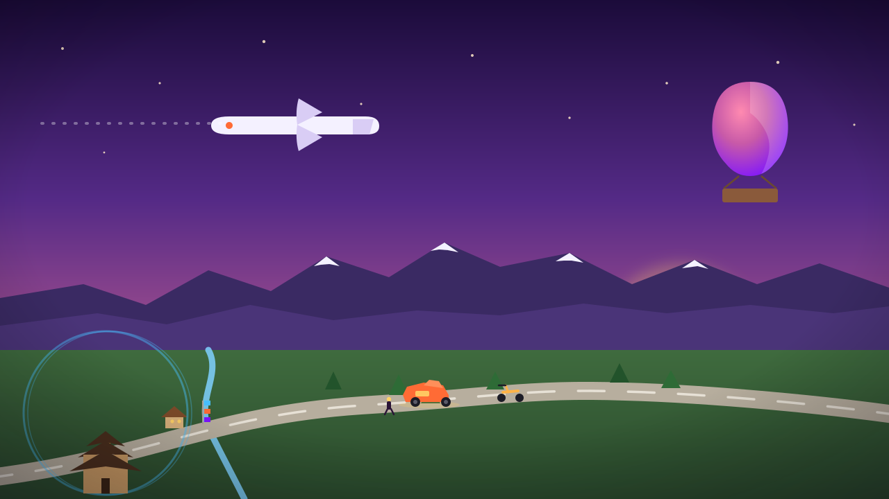
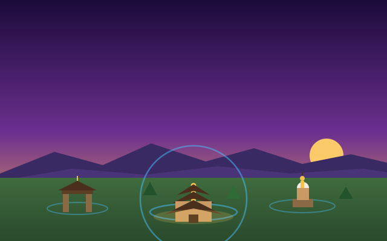
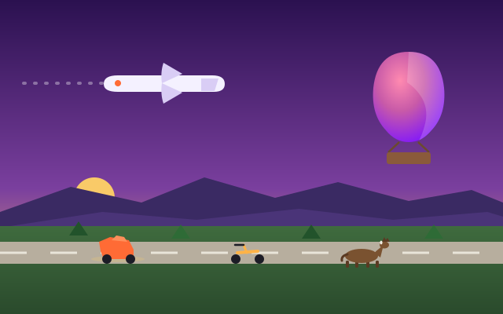
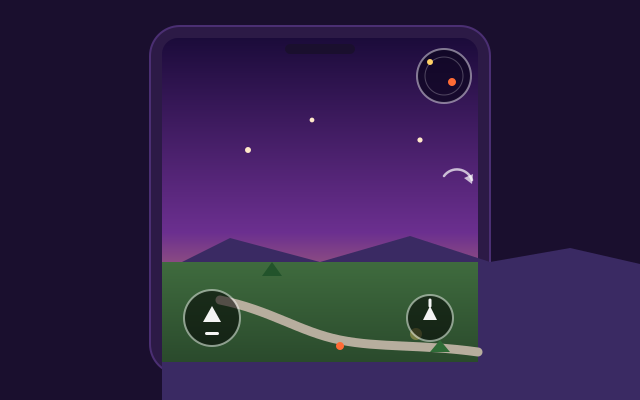

<p align="center">
  
</p>

---

# 🇳🇵 Nepal 3D Portfolio

> **An interactive 3D portfolio set in a stylised low-poly Kathmandu Valley.** Walk,
> drive, ride, fly and parachute your way between landmarks that open your
> **About — Skills — Projects — Contact — My Story** sections — a content-driven
> alternative to scrolling-scroll-scrolling.

<p align="center">
  <a href="https://jeevannar16-web.github.io/Nepal-3d-portfolio/">
    
  </a>
  
  
  
  
  
</p>

**▶ Try it live:** <https://jeevannar16-web.github.io/Nepal-3d-portfolio/> — works on desktop *and* mobile.

---

## ✨ Highlights

### 🗺️ Explore the valley, landmark by landmark

<p align="center">
  
</p>

A ~300×300 low-poly valley holds **five clickable landmarks** — a pagoda temple,
Dharahara tower, city gate, mountain and stupa — loaded from real `.glb` models
with blob shadows and glow rings. Click or tap any landmark to open its portfolio
section; a halo highlights it on hover, and the minimap flies you anywhere on tap.

### 🚗 Drive, ride, fly — or bail out

<p align="center">
  
</p>

Start on foot as a soldier, then hop into a **sports car** (real powertrain:
engine, RPM, automatic gearbox and gear selector), a **motorcycle**, a **horse**,
one of **two flyable airplanes**, or a **hot-air balloon**. In the air, press
**Z / Esc** to bail out and parachute down while the vehicle auto-lands itself.

### 📱 Feels native on a phone

<p align="center">
  
</p>

A single **Run** button (tap to sprint, tap again to stop) and a **Jump** button
drive on-foot movement. Everything else — looking around, steering vehicles, and
the camera orbit — is a right-side drag, with a live minimap in the corner. The
camera settles back behind you on release so the rider always faces forward.

## 🌄 Feature list

- **Cinematic intro** — an airplane arrival (taxi → takeoff → valley flyover →
  landing) that auto-skips, with a variant chosen by your IP region.
- **Live atmosphere** — real Kathmandu weather (rain, fog) and time of day
  (day/dusk/night) fetched live and applied to the scene; overridable from Settings.
- **Navigation** — WASD to drive, click-to-fly minimap, and a top bar that flies
  the camera between sections with a travelling indicator.
- **Scenery** — instanced trees, houses and prayer flags along the roads keep the
  draw-call cost low while the valley feels alive.
- **Sound** — procedural engine, horse-gait and airplane soundtracks, honk, and
  UI clicks, all respecting the mute toggle.
- **Persistent preferences** — sound, reduced graphics, camera sensitivity and
  unlocked zones survive reloads via localStorage.
- **Adaptive performance** — a GPU/RAM tier check drops to reduced graphics
  (lower DPR, no bloom/SSAO, smaller shadows) on weak hardware; a WebGL
  context-loss handler swaps to the 2D view instead of going blank.
- **Responsive fallback** — low-end devices get a clean 2D page driven by the
  same content file.

## 🎮 Controls

| Input | Action |
| --- | --- |
| **WASD / Arrow keys** | Move the current vehicle (car, bike, horse, plane, balloon, walk) |
| **A / D (on foot)** | Turn — hold to rotate smoothly, tap for a precise nudge |
| **E** | Board the nearest vehicle |
| **Z / Esc** | Get out — in the airplane/balloon this bails you out under a parachute |
| **Space** | Jump (on foot) |
| **Shift / Shift+S (on foot)** | Sprint (hold) / sprint latch (toggle) |
| **G / R** | Car: ignition / D–R gear selector |
| **Q / E** | Airplane: bank left / right |
| **Minimap** | Click a landmark to fly the camera to it |
| **Nav menu** | Explore / Transport / Settings / About tabs |
| **Landmark** | Open its portfolio panel |
| **Touch (mobile)** | **Run** (tap to sprint, tap again to stop), **Jump**; drag the right side to look / steer |

The top-right menu has four tabs: **Explore** (the portfolio sections),
**Transport** (hop straight into any vehicle you've parked), **Settings** (sound,
graphics, camera sensitivity, time of day, weather) and **About**.

## 🧠 Project structure

```
├─ .github/workflows/deploy.yml   # GitHub Pages CI (build + deploy on push)
├─ public/
│  ├─ models/                     # all .glb models (vehicles, landmarks, soldier…)
│  ├─ data/                       # portfolio.json (content served at runtime)
│  └─ hdr/                        # HDRI environment map
├─ docs/illustrations/            # README artwork (SVG)
├─ scripts/                       # asset build / sound / animation helpers
├─ src/
│  ├─ data.ts                     # ALL portfolio content + landmark layout (edit this)
│  ├─ world.ts                    # road network polylines + seeded randomness
│  ├─ components/
│  │  ├─ Scene3D.tsx              # the 3D world: canvas, sky, physics, overlays
│  │  ├─ Scene2D.tsx              # plain scrollable page (mobile / low-end)
│  │  ├─ Player.tsx               # the sports car + powertrain physics
│  │  ├─ WalkController.tsx       # on-foot soldier (walk/run/jump/crouch, boarding)
│  │  ├─ BikeController.tsx       # motorcycle
│  │  ├─ HorseController.tsx      # horse (gait-matched gallop)
│  │  ├─ AirplaneController.tsx   # flyable airplane (airport + airstrip slots)
│  │  ├─ HotAirBalloonController.tsx # balloon with seated rider
│  │  ├─ ParachuteController.tsx  # bail-out parachute descent
│  │  ├─ Soldier.tsx / Rider.tsx  # the avatar + seated-rider IK rig
│  │  ├─ Landmarks.tsx / Landmark.tsx # landmark visuals + triggers
│  │  └─ …                        # HUD, minimap, nav, sounds, overlays
│  ├─ store/                      # zustand stores + mutable runtime state
│  │  ├─ useStore.ts              # central store (playerMode, intro, settings…)
│  │  ├─ transportState.ts        # vehicle/walker poses, active plane
│  │  ├─ autoPilot.ts             # vehicle auto-land flags after bailing out
│  │  ├─ walkState.ts             # walk inputs, HUD + grounded/animation flags
│  │  ├─ driveState.ts            # car engine/RPM/gear for the speedometer
│  │  └─ minimapState.ts          # live player position for the minimap
│  ├─ utils/                      # assetUrl, weather, timeOfDay, geo, IK, sounds…
│  └─ hooks/
└─ vite.config.ts                 # Vite base configured for the Pages subpath
```

## 🛠 Stack

- **React 19 + TypeScript** on **Vite**
- **@react-three/fiber · drei · rapier** — Three.js scene + physics
- **zustand** — state, **Tailwind CSS 4** — UI overlays
- Deployed to **GitHub Pages** by GitHub Actions on every push to `main`

## 🚀 Run locally

```bash
npm install
npm run dev      # http://localhost:5173
```

`npm run build` (type-check + production build) and `npm run lint` are wired in.

## ☁️ Deploy

Pushing to `main` runs `.github/workflows/deploy.yml`, which builds and deploys
to GitHub Pages automatically:

**https://jeevannar16-web.github.io/Nepal-3d-portfolio/**

> If you don't see the latest changes, hard-refresh (**Ctrl+Shift+R** /
> **Cmd+Shift+R**) or open the site in a private window — the browser caches the
> previous build.

## 🎨 Customise

- **Portfolio content** — everything (zones, about, skills, projects, contact,
  story, landmark layout) lives in `src/data.ts` and `public/data/portfolio.json`.
  Edit the file, push, done.
- **Driving / feel** — handling constants (`MAX_SPEED`, `THROTTLE_ACCEL`,
  `TURN_RATE`, `LATERAL_GRIP`, `CRUISE_ALT`, jump/gravity terms, …) sit at the top
  of each controller as named constants, ready to tune.
- **Models** — drop a `.glb` into `public/models/` and reference it in a
  controller; landmark models are pointed to by `modelPath` in `src/data.ts`.
- **Animation** — the soldier's clips are retargeted onto the avatar automatically
  (`src/utils/retargetAnimations.ts`); locomotion is cross-faded and speed-matched.

---

<p align="center">
  <sub>Built with 💜 in Kathmandu · <a href="https://jeevannar16-web.github.io/Nepal-3d-portfolio/">visit the valley</a></sub>
</p>